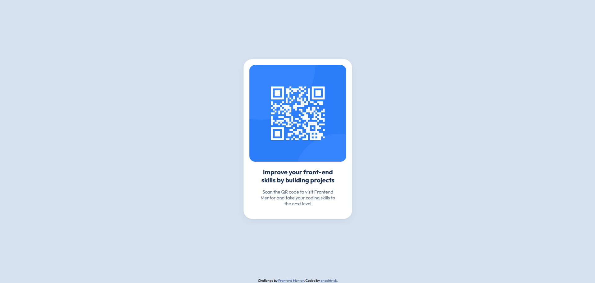

# Frontend Mentor - QR code component solution

This is a solution to the [QR code component challenge on Frontend Mentor](https://www.frontendmentor.io/challenges/qr-code-component-iux_sIO_H).

## Table of contents

- [Overview](#overview)
  - [Screenshot](#screenshot)
  - [Links](#links)
- [My process](#my-process)
  - [Built with](#built-with)
  - [What I learned](#what-i-learned)
  - [Continued development](#continued-development)
- [Acknowledgments](#acknowledgments)

## Overview

### Screenshot

### Links

- Solution URL: [Add solution URL here](https://your-solution-url.com)
- Live Site URL: [Add live site URL here](https://your-live-site-url.com)

## My process

### Built with

- Semantic HTML5 markup
- CSS custom properties
- Flexbox

### What I learned

It was very useful practice to work at meeting specific requirements through a style guide and having an image to replicate. This encouraged me to be precise and deliberate when styling the page.

### Continued development

I need more confidence in structuring the elements within the page in more complex scenarios. Also unsure if the way i sized the image and card could have been done in a more efficient way.

## Acknowledgments

My only recent experience in HTML and CSS comes from following Traversy Media's Udemy course
